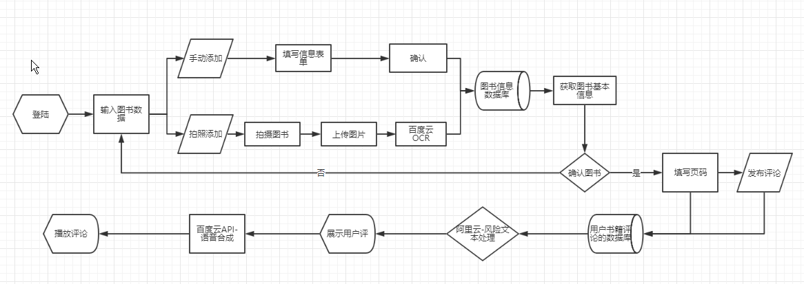
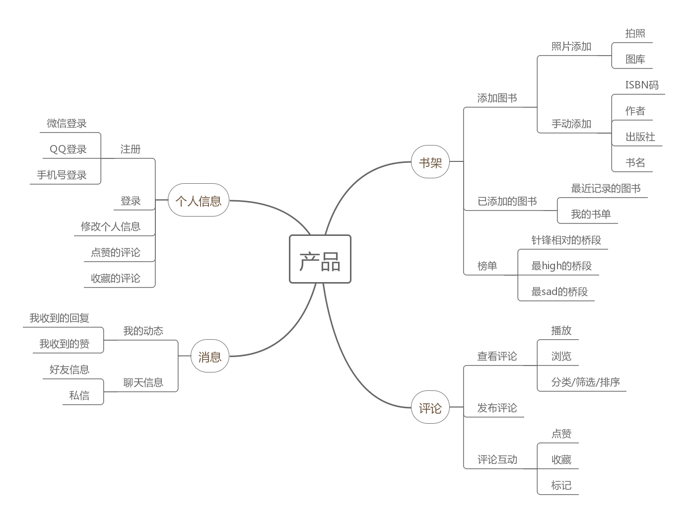
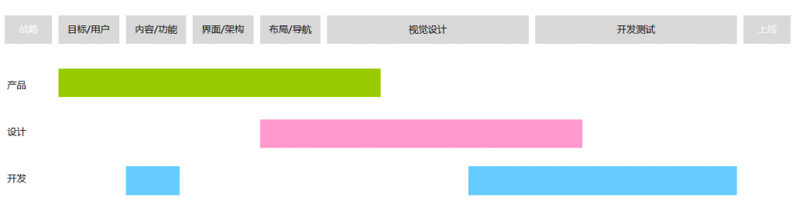
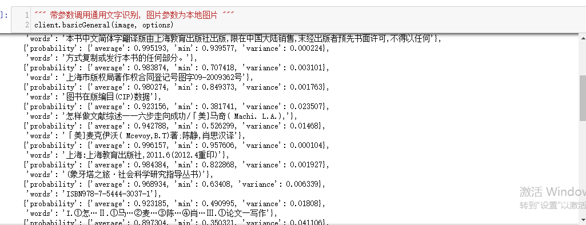
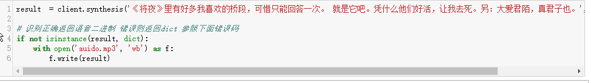

# AI_Reading_Improvise_Commentary

## Product Requiremenets

<table>
    <tr>
        <td><b>Target release</b></td>
        <td>2018/12/16</td>
    </tr>
        <tr>
        <td><b>Epic</b></td>
        <td><a href="#063">评论页面</a></td>
    </tr>    
    <tr>
        <td><b>Document status</b></td>
        <td><b><code>DRAFT</code></b></td>
    </tr>    
    <tr>
        <td><b>TDocument owner</b></td>
        <td><a href="https://www.github.com/treeice">@林树斌</a></td>
    </tr>    
    <tr>
        <td><b>Designer</b></td>
        <td><a href="https://www.github.com/treeice">@林树斌</a></td>
    </tr> 
    <tr>
        <td><b>TDocument owner</b></td>
        <td><a href="https://www.github.com/treeice">@林树斌</a></td>
    </tr> 
    <tr>
        <td><b>Developer</b></td>
        <td>&nbsp;</td>
    </tr> 
    <tr>
        <td><b>QA</b></td>
        <td>&nbsp;</td>
    </tr> 
</table>

## Table of contents
- [Produce Overview](#01)
- [Background and strategic fit](#02)
- [Questions](#03)
- [Product goal & scope](#04)
- [Product Principle](#05)
- [Rwquirements](#06) 
- - [User Portrait](#061)
- - [context scenario](#062)
- - [Epic](#063)
- - [User Story](#064)
- [User intercaion and design](#07)
- [Time and Team](#08)
- [Not doing](#09)
- [Attachment](#10)

##  <a id="01">Product Overview</a>
软件解决用户在独自阅读纸质书时缺乏评论交流的问题，提供对应书本的对应页面的评论功能，满足用户在个人阅读情景中对于书中的内容进行评论的需求，建立参与式阅读评论的平台。利用<a href="https://ai.aliyun.com/lvwang/text?spm=5176.8142029.artificialIntelligence.47.54216d3eQDorG9">阿里云API-文本风险内容识别</a>和<a href="https://cloud.baidu.com/product/ocr/general">百度云API-通用文字识别</a>，为用户过滤无价值与有害的内容，打造健康的和丰富的评论区内容，使用<a href="https://cloud.baidu.com/product/nlp/sentiment_classify">百度云API-文本情感分析技术</a>和<a href="https://cloud.baidu.com/product/speech/tts">百度云API-语音合成</a>，帮助用户筛选后听评论，优化用户阅读体验和提升产品的评论筛选效率。为用户带来参与式评论的陪伴互动体验

## <a id="02">Background and strategic fit</a>
当前中国阅读纸质书的且有孤独感的90后,人数多,市场巨大。脉脉数据研究院联合小猪短租发布2017年度职业数据白皮书《孤独经济》中提到了22-30岁的年龄段的人的孤独比例是60.8%。当当网与易观联合发布《2018 中国图书阅读市场专题分析报告》中指出在纸质图书阅读数据中 ,30 岁以下读者比例达到52.3%，当代年轻人的知识焦虑和孤独感的爆发，看书阅读是他们缓解压力和获取知识的主要手段之一.根据马斯洛需求原则的第三层社交需求，普遍的90后在衣食住行等方面没有问题，在社交上，年轻人总是难以找到陪伴和分享心事的场所，相较朋友圈的好友数量的泛滥导致发布的限制，微博的互动用户太过广泛,找不到同一话题的人，豆瓣和知乎等文艺青年和知识青年群体论坛社区,都不适合分享个人的即时性阅读评论.

## <a id="03">Questions</a>

Questions|Qutcome
-|-
提供经过“垃圾文本处理后干净健康”的用户阅读书籍的评论|帮助读者用户更好获取评论内容
使用语音合成,播放用户可能感兴趣的评论语音播放|解决用户在阅读情景中无法同时看书与看评论的问题
检测书本相应位置的照片，自主检测书本信息获取当前用户正在阅读的书本信息|辅助用户快速获取书籍信息，优化用户体验流程
使用文本情感分析技术来分析用户在软件的评论信息|获取用户对于书本的喜好信息,播放用户喜欢的评论

## <a id="04">Product goal & scope</a>
- 用户提交图书信息照片后，获取书籍信息的时长在1min以内
- 用户在发布评论后，5s内看到自己的评论优先显示出来
- 软件上线的一个月内，50%的初次使用软件的用户会在软件上记录他们的书籍并留下评论
- 软件上线的一个月内，60%用户在软件开启后，运行状态时长在30分钟以上
- 软件上线的一个月内，用户在软件上提交的有记录的小说，需要和当当等购书平台的热门小说书籍排行的前1000至少要有90%的重合
- 软件上线的一个月内，30%的用户在阅读同一本书的内容结束后至少在10页评论区发布了评论
- 软件上线的一个月内，30%的用户在使用软件阅读时候，打开了评论内容播放功能

- 只提供书籍的评论，不提供书籍内容的阅读

## <a id="05">Product Principle</a>
- 平静技术互动原则
- 安静，干净

## <a id="06">Rwquirements</a>

### <a id="061">User Portrait</a>

<table>
<tr>
    <td><b>name</b></td>
    <td>胡胡</td>
    <td><b>性别</b></td>
    <td>男</td>
    <td rowspan="3"></td>
</tr>
<tr>
    <td><b>age</b></td>
    <td>21</td>
    <td><b>Identity</b></td>
    <td>大三</td>
</tr>
<tr>
    <td><b>University Majors</b></td>
    <td>网络与新媒体专业</td>
    <td><b>location</b></td>
    <td>广州</td>
</tr>
<tr>
    <td><b>Hometown</b></td>
    <td>潮州</td>
    <td><b>hobby</b></td>
    <td colspan="2">打羽毛球，打电玩,喜欢科幻电影,看玄幻小说和动漫，看科幻小说和魔幻小说，学画画，学设计</td>
    </tr>
<tr>
    <td><b>Course</b></td>
    <td colspan="4">《互动设计》，《网站运营》，《大数据分析》，《自然模块-科学技术发展史》，《西方艺术史》，《批判性思维》，《品牌战略管理》，《批判性思维》，《管理学》，《品牌策划》，《人文-语文》</td>
</tr>
<tr>
    <td><b>Friends</b></td>
    <td colspan="2">同班同学和临近宿舍的朋友为主,经常一起打游戏和玩耍,交流多以学业和身边娱乐为主,会一起组队做课程作业,,也有因为打羽毛球而相识的球友,但和朋友之间不会主动提及读书分享</td>
    <td><b>Roomaate</b></td>
    <td colspan="2">喜欢打电脑游戏,喜欢打球,埋头专研学课作业和兴趣,不爱看课外文学作品,喜欢追番和搞笑新闻,浏览各类社交平台,会一起吃饭</td>
</tr>
<tr>
    <td><b>Use of electronic equipment</b></td>
    <td colspan="2">使用智能手机和电脑,在宿舍内,以电脑为主,在宿舍就维持电脑开启状态,在外平常半小时打开手机一次,课堂上至少十五分钟打开手机一次,手机保持唤醒状态有至少四小时,</td>
    <td><b>Dating software usage</b></td>
    <td colspan="2">每天花费两个小时在微信聊天和朋友圈的浏览中,会浏览微博,知乎,哔哩哔哩等软件</td>
</tr>
<tr>
    <td><b>Rest and recuperation arrangements</b></td>
    <td colspan="2">周末,九点起床,九点半来图书馆看书,十二点吃饭,一点回宿舍打游戏或做作业,三点睡午觉,五点吃饭打球,晚上八点回宿舍,十二点至一点睡觉</td>
    <td><b>Reading situation</b></td>
    <td colspan="2">周末九点半后到中午十二点,一个人在图书馆看书.上课时在教室的课堂上看书,偶尔在宿舍看书</td>
</tr>
</table>

### <a id="062">context scenario</a>
<table>
    <tr>
      <th width="2%">&nbsp;</th>
      <th width="8%">Title</th>
      <th width="40%">User stroy</th>
      <th width="10%">Importance</th>
      <th width="40%">Notes</th>
    </tr>
    <tr>
        <td><b>1</b></td>
        <td>看小说的人</td>
        <td>胡胡在周末独自一个人来到学校图书馆查看小说消遣，找到小说后，阅读小说的时候，由于情节的跌宕，情绪和心思一时此起彼伏，当下他想和他人分享此刻的紧张感和激动，他进入软件，打开手机，进入对应的书籍的对应页面，急匆匆留下评论“杨康居然偷袭刺伤了郭靖！！！”，看到了很多人留下了类似的评论,打开软件的播放评论功能,软件把通过筛选后的有意思的评论播放出来,小东听着评论，继续读书</td>
        <td><b><code>Importance</code></b></td>
        <td>使用<a href="https://ai.aliyun.com/lvwang/text?spm=5176.8142029.artificialIntelligence.47.54216d3eQDorG9">阿里云API-文本风险内容识别</a>过滤掉评论区中无价值和灌水的评论,让用户更好地看到有兴趣的评论内容，和使用<a href="https://cloud.baidu.com/product/ocr/general">百度云API-通用文字识别来</a>帮助用户更快地获取进入图书，参与用户的小说的评论流程，使用<a href="https://cloud.baidu.com/product/nlp/sentiment_classify">百度云API-文本情感分析技术</a>和<a href="https://cloud.baidu.com/product/speech/tts">百度云API-语音合成技术</a>,播放用户所感兴趣的评论和用户评论同个情绪的同类型的评论.要点是快速让用户在情绪的波动之中,登陆软件,找到图书,留下评论,应该着重优化用户拍照识别图书的流程.</td>
    </tr>
    <tr>
        <td><b>2</b></td>
        <td>翻阅其它专业性强的书的人</td>
        <td>胡胡在学期选择了一门公选课叫做*企业战略管理*，老师要求他们在课外，阅读推荐的专业书籍来完成期末报告，他到学校的图书馆找到了《事业战略管理》来看，但是他是新媒体专业的，对这种专业性强的内容一窍不通,打开书的目录后，只能选择性挑着所需的章节翻阅，看到相关的页码中出现了“后一体化”，“低领导战略”等专业名词，他一点也不懂，也不想再花时间翻阅前面的内容或去找第二本书等渠道来了解这词语的意思，他打开了软件。扫描书本封面，获取了该书的评论信息，进入到了这本书的页面后，看到了早已有其他人和他一样评论了对专业词语的困惑，也看到了个别用户对这类评论的解答并指出对应页码的解释等详细信息，他了解这个词汇之后，觉得得到了满意的解决</td>
        <td><b><code>general</code></b></td>
        <td>加入字体颜色变化，对解释性和科普性质的评论进行突出显示和标记。和加入点赞的功能,置顶部分用户觉得有价值的评论,消除不正当的评论,使用<a href="https://ai.aliyun.com/lvwang/text?spm=5176.8142029.artificialIntelligence.47.54216d3eQDorG9">阿里云API-文本风险内容识别</a>和<a href="https://cloud.baidu.com/product/ocr/general">百度云API-通用文字识别</a>等优化评论,在相应的专业图书中,快速展现这类科普性评论</td>
    </tr>
    <tr>
        <td><b>3</b></td>
        <td>读诗歌的人</td>
        <td>汉语言专业的小北在晚上上床之前，打开了白天在本校的图书馆借阅的《新宋词300首》，在阅读其中某一首词后，心中思绪万千十分失落，她扫描书本封面，获取了该书的评论信息，进入到了这本书的页面后，她看着很多借阅的人对这页诗的评论，或好或坏,开启语音功能进行筛选出悲伤情绪的评论，她听到到其中有一条评论内容和自己心中不谋而合，十分开心点赞评论</td>
        <td><b><code>general</code></b></td>
        <td>使用<a href="https://cloud.baidu.com/product/nlp/sentiment_classify">百度云API-文本情感分析技术</a>和<a href="https://cloud.baidu.com/product/speech/tts">百度云API-语音合成技术</a>,播放对应到用户所感兴趣的和用户评论同个情绪的同类型的评论,维持用户在情绪波动的环境之中</td>
    </tr>
    <tr>
        <td><b>4</b></td>
        <td>打卡的人</td>
        <td>胡胡最近想看金庸的套书，于是找了一份金庸系列小说的顺序清单，他去了图书馆，按照书单一本书一本书地看，在课余时间慢慢借阅完了一系列图书，《书剑恩仇录》，《碧血剑》......一直到《鹿鼎记》，看完每一本书，他都会打开软件扫描书本封面，获取了该书的评论信息，进入书本的最后一页，留下评论“2018年11月30号，晚上8点看完，打卡(oﾟvﾟ)ノ,完结撒花”来记录自己的行为</td>
        <td><b><code>pend</code></b></td>
        <td>增加快速添加打卡信息（时间，位置，心情），功能和情绪类颜文字/表情</td>
    </tr>
</table>

### <a id="063">Epic</a>
#### Epic:评论页面
胡胡一边看书，遇到剧情紧张的时候，在评论页面留下了紧张的评论内容，查看了其他用户都在预测下一页面会发生什么情节的评论，对各种奇思妙想，剧情推理，知识科普进行点赞，收藏了其他用户的神展开的补充评论，和同个页面的评论按照时间倒叙进行评论回复后,打开评论播放,听其他用户的评论内容.

### <a id="064">User Story</a>
1. 作为胡胡，我想要在书中对应页面和同时在看这本书和同个页面看书的用户进行<b>评论</b>
2. 作为胡胡，我想要<b>时间倒叙查看</b>所有用户的评论
3. 作为胡胡，我想知道大家在看这页面时候主要说了什么，<b>热门评论</b>是什么
3. 作为胡胡，我想<b>收藏</b>评论
4. 作为胡胡，我想<b>听</b>书的评论
5. 作为胡胡，我想<b>标记、分辨</b>评论中的科普知识

## <a id="07">User intercaion and design</a>

- **输入**：图书封面（*OCR扫描技术*），文字评论（文本过滤）

    **输出**：图书信息（书名，出版社，版本号），语音播放（*语音合成*）
	
### 产品流程图 

### 产品信息框架图
以线性结构为主的信息架构,通过记录书籍信息后,在图书的对应页码中浏览或发布相关评论,在所需时候,使用语音功能,为用户提供个性化的评论播放,满足用户在阅读时候的自我表达需求

### 主要功能的简单原型页面
[主要功能的简单原型页面]( http://treeice.gitee.io/appprototype)

## <a id="08">Time and Team</a>

### Code

图片文本检测

文字转语音

### API评价
1.  百度的NLP API还是挺好用的 -- [百度AI平台自然语言处理API调用（情感分析案例）](https://blog.csdn.net/ChenVast/article/details/82682750)  
2. 在多个垂类上（汽车、餐饮、酒店等）情感倾向性分析准确率达到95%以上，已应用于实际产品中 -- [百度AI平台自然语言处理自我评价](https://cloud.baidu.com/product/nlp/sentiment_classify)
3. 情感分析上,抓取了豆瓣五本小说的评论(共50条)进行百度云-文本情感倾向(本人)人工测试,判断结果一致的有90%,普通用户的QPS为5,提升QPS需要另外申请,文本数据多的时候,会较慢 --[抓取豆瓣某书评进行百度云-情感分析测试](https://github.com/treeice/APPPrototype/blob/master/抓取豆瓣某书评进行百度云-情感分析测试.ipynb)
4. 百度云在自然语言分析上,每日配额无限制,文本审核为10000次/天免费,远远低于[阿里云的文本分析功能的限额](https://common-buy.aliyun.com/?spm=5176.8050869.0.0.ea2a2c88VAd3v5&commodityCode=cdibag#/buy),在新软件上线之初,资金是一个重要考虑因素
5. 百度云的语音合成功能-也是每日无限额,能准确播放对应文字
6. 百度云的文本反垃圾机制,使用SDk运行时,返回代码未写明审核不过的原因,[网页](http://ai.baidu.com/tech/textcensoring)上测试时,网页有提示什么原因的问题

## <a id="09">Not doing</a>
- 对于评论的进一步细化过滤体系,有待商榷
- 评论的情感分析规则,有待商榷
- 用户的平看书习惯,评论的口味数据收集,依据用户过滤,为用户进行推荐
- 收集用户评价信息,设置系统的快速文本填充,帮助在于用户快速发表评论
- 书籍的评论和评论之间加入链接,页码和页码之间进行打通

## <a id="10">Attachment</a>
- [软件流程图](https://raw.githubusercontent.com/treeice/API_ML_AI/master/Images/FLowchart.png)
- [开发流程图](https://raw.githubusercontent.com/treeice/API_ML_AI/master/Images/PRD01_Timeline.png)
- [产品信息框架图](https://raw.githubusercontent.com/treeice/API_ML_AI/master/Images/Information_Framework.png)
- [图片检测-代码展示](https://raw.githubusercontent.com/treeice/API_ML_AI/master/Images/test-ocr.png)
- [文字转语音-代码展示](https://raw.githubusercontent.com/treeice/API_ML_AI/master/Images/test-audio.png)
- [产品原型导出的HTML文件](https://github.com/treeice/APPPrototype)
- [图片识别_文本情感分析_语音合成_输入输出文档](https://github.com/treeice/APPPrototype/blob/master/code/图片识别_文本情感分析_语音合成_输入输出文档.ipynb)
- [抓取豆瓣某书评进行百度云-情感分析测试_文档](https://github.com/treeice/APPPrototype/blob/master/code/抓取豆瓣某书评进行百度云-情感分析测试.ipynb)

