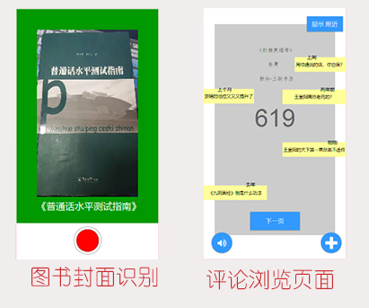

# AI_Reading_Improvise_Commentary

## Product Requiremenets

 - | -
 |:- | :-|
 **Target release** | 2018/11/30
 **Epic**| -
 **Document status**| ```DRAFT```
 **Document owner** | [@L林树斌](https://www.github.com/treeice)
 **林Designer** | [@树斌](https://www.github.com/treeice) 
 **Developer** | -
 **QA** | -

## Goals
解决大学生在本校图书馆看书的时刻需要分享个人评论的问题，为大学生在翻阅本校图书馆的图书的时候提供读书弹幕弹幕功能，满足用户在读书的某一时刻分享心得的需求。让用户记录阅读的过程种，那特定时刻所想所感，并分享发布，提供大学生提供本校的阅读评论分享浏览的互动平台。

## Background and strategic fit
根据中国统计局的数据显示：普通本专科招生人数从2013年的699.833万人，逐年增加，到2017已有761.489万人。本科和专科的在校学生占社会人口总比重不断上升和当当网与易观联合发布《2018 中国图书阅读市场专题分析报告》中指出在纸质图书阅读数据中 ,30 岁以下读者比例达到 52.3%，这个是巨大的年轻的大学生市场群体，大学生群体由于学业和身份的关系，本校的图书馆会是他们交流阅读和获取知识的主要场所，根据马斯洛需求原则的第三层社交需求，普遍的大学生在衣食住行等方面没有问题，在社交上，本校的学生总是难以找到陪伴的书友，这个平台会为他们提供在一定程度的社交交友的功能

## Assumptions
- 用户使用软件时候，使用带有拍摄，播放音频和具备连接网络功能的智能手机和平板设备


## Rwquirements

#| Title |User stroy | Importance |Notes
-|-|-|-|-
**1**|看小说的人| 小东在周末独自一个人来到学校图书馆查看小说消遣，找到小说后，通过扫描图书封面，来获取该书的网友评论资源，阅读小说的时候，看到情节的跌宕而收到影响，一时心急，想和他人分享这个心情，进入软件，在对应的书籍的对应页面上发布评论，留下评论，且查看到了很多同样评论的其他人，心里得到满足|```Importance```| 可使用随机播放评论音频的方式来参与用户的阅读流程，使用到了语音合成，使用[百度云API-语音合成](https://cloud.baidu.com/product/speech/tts)
**2**|翻阅专业性强的书的人| 小西在学期选择了一门公选课叫做*企业战略管理*，老师要求他们在课外，阅读推荐书籍，她到学校的图书馆找到了《事业战略管理》来看，但是她是学设计的专业的，打开书的目录后，选择性挑着所需的章节翻阅，看到相关的章节中出现了“后一体化”，“低领导战略”等专业名词，她一点也不懂，她也不想再花时间翻阅前面的内容或去找第二本书等渠道来了解这词语的意思，她打开了软件。扫描书本封面，获取了该书的评论信息，进入到了这本书的页面后，她看到了早已有其他人和他一样评论了对专业词语的困惑，也看到了其它人对这个问题的解答并指出对应页码的解释等信息，她了解这个词汇之后，觉得得到了满意的解决|```Importance```|加入字体颜色变化，对解释性和科普性质的评论进行突出显示。和加入点赞的功能置顶部分用户觉得有价值的评论,消除不正当的评论,使用[阿里云API-文本风险内容识别](https://ai.aliyun.com/lvwang/text?spm=5176.8142029.artificialIntelligence.47.54216d3eQDorG9)和[百度云API-通用文字识别](https://cloud.baidu.com/product/ocr/general)
**3**|读诗歌的人|汉语言专业的小北在晚上上床之前，打开了白天在本校的图书馆借阅的《新宋词300首》，在阅读其中某一首诗后，觉得心里有话想说，她扫描书本封面，获取了该书的评论信息，进入到了这本书的页面后，她看到了很多之间借阅的人对这页诗的评论，或好或坏，她看到其中一条上个月的评论和自己心中所想一摸一样，十分开心并加入那个用户为好友，相互认识|```general```| 评论中，增加地理位置划分，和时间信息的展示
**4**|打卡的人|小南最近想看金庸的套书，不知从何看起，所以找了一份金庸的系列小说的顺序清单，他于是去了图书馆，找到了着一本书，在课余时间慢慢借阅这一套图书来观看，《书剑恩仇录》，《碧血剑》......一直到《鹿鼎记》，，看完每一本书，他都会打开软件扫描书本封面，获取了该书的评论信息，进入书本的最后一页，留下评论“2018年11月30号，晚上8点看完，大咖(oﾟvﾟ)ノ”|```pend```| 增加快速添加打卡信息（时间，位置，心情），功能和情绪类颜文字/表情

## User intercaion and design
- 平静技术互动原则
- **输入**：图书封面（*OCR扫描技术*），文字评论（文本过滤）

    **输出**：图书信息（书名，出版社，版本号），语音播放（*语音合成*）
    


### 主要功能的简单原型页面



## Questions

Questions|Qutcome
-|-
提供点赞，置顶，对特定的评论进行筛选强调突出,通过对文本风险内容识别帮助用户清除部分不良评论|辅助用户获取有价值和又有兴趣的信息
使用语音合成,播放语音|解决用户在特定情景无法看评论,却需要人陪同吐槽
拍照检测入口|辅助用户快速获取书籍信息
提供位置信息，切换地址位置|显示附近的评论提供用户交流等方式

## Time and Team


## Not doing
- 对于评论的进一步细化过滤体系,有待商榷
- 部分图书封面设计新颖,使用各种不规则图形,超出OCR所能接受的文本格式,在扫描上可能准确度会比较低,或许有更好的书籍信息登记
- 播放语音,尝试使用[百度云API-情感倾向分析](https://cloud.baidu.com/product/nlp/sentiment_classify)帮助用户,播放用户可能会感兴趣的评论


