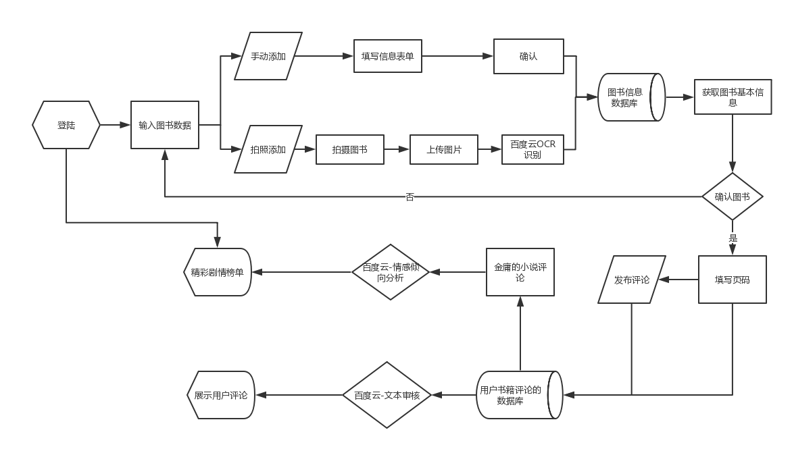

# AI_Novel_Wonderful_Plot

## Product Requiremenets

<table>
    <tr>
        <td><b>Target release</b></td>
        <td>2018/12/30</td>
    </tr>
        <tr>
        <td><b>Epic</b></td>
        <td><a href="#063">精彩剧情榜单回顾</a></td>
    </tr>    
    <tr>
        <td><b>Document status</b></td>
        <td><b><code>Finished</code></b></td>
    </tr>    
    <tr>
        <td><b>TDocument owner</b></td>
        <td><a href="https://www.github.com/treeice">@林树斌</a></td>
    </tr>    
    <tr>
        <td><b>Designer</b></td>
        <td><a href="https://www.github.com/treeice">@林树斌</a></td>
    </tr> 
    <tr>
        <td><b>TDocument owner</b></td>
        <td><a href="https://www.github.com/treeice">@林树斌</a></td>
    </tr> 
    <tr>
        <td><b>Developer</b></td>
        <td>&nbsp;</td>
    </tr> 
    <tr>
        <td><b>QA</b></td>
        <td><a href="https://www.github.com/treeice">@林树斌</a></td>
    </tr> 
</table>

## Table of contents
- [Produce Overview](#01)
- [Background and strategic fit](#02)
- [Questions](#03)
- [Product goal & scope](#04)
- [Product Principle](#05)
- [Rwquirements](#06) 
- - [User Portrait](#061)
- - [context scenario](#062)
- - [Epic](#063)
- - [User Story](#064)
- [User intercaion and design](#07)
- [Time and Team](#08)
- [Not doing](#09)
- [Attachment](#10)

##  <a id="01">Product Overview</a>
软件解决用户在独自阅读纸质书时缺乏评论交流的问题，提供对应书本的对应页面的评论功能，满足用户在个人阅读情景中对于书中的内容进行评论的需求,**主打金庸笔下的系列武侠小说的经典剧情榜单**，根据评论热度,建立书籍精彩剧情榜单,提供对应小说的精彩剧情讨论热点入口,帮助用户快速加入其他读者也在讨论的剧情热点,满足用户的剧情阅读参与感,建立参与式阅读评论的平台。

1. 使用<a href="https://cloud.baidu.com/product/nlp/sentiment_classify">百度云API-文本情感倾向分析</a>,分析用户留下评论的情感极值,比对出剧情的讨论热度,展示经典剧情的讨论榜单
2. 利用<a href="http://ai.baidu.com/tech/textcensoring">百度云-文本审核技术</a>，为用户过滤无价值与有害的内容，打造健康的和丰富的评论区内容
3. 通过<a href="https://cloud.baidu.com/product/ocr/general">百度云API-通用文字识别</a>,帮助用户简化书籍选择流程,优化用户提体验

## <a id="02">Background and strategic fit</a>
金庸有着14部武侠小说,发行量超**3亿**册,受众之广大,在网络的三大话题平台,知乎,豆瓣,微博中,关于金庸,及其各本小说的话题讨论量非常高
- 在主打互联网和精英思考的论坛,知乎的话题"金庸"有**217,524**人关注,且有**11,384**个问题被讨论,相关的小说话题"射雕英雄传","天龙八部","笑傲江湖"等话题都有**过万**人关注量,发起**过千**的问题,且内容持续更新中。
- 在文艺青年的书评社区豆瓣读书,"射雕英雄传","神雕侠侣","笑傲江湖"等评价中,每部小说不同版本累计总和都有过**五万**的评论。
- 在社会全民信息分享和交流平台的微博,光#射雕英雄传话题已有**10.2万**人讨论,和**1.2亿**的阅读量,#神雕侠侣话题有 **160.6万**讨论和**60.7亿**阅读

## <a id="03">Questions</a>

Questions|Qutcome
-|-
使用文本情感分析技术来分析用户在软件的评论信息|获取用户对于书本的章节的评论的情感极值的倾向,得出精彩讨论的剧情排行榜
提供经过“垃圾文本处理后干净健康”的用户阅读书籍的评论|帮助读者用户更好获取评论内容
检测书本相应位置的照片，自主检测书本信息获取当前用户正在阅读的书本信息|辅助用户快速获取书籍信息，优化用户体验流程

## <a id="04">Product goal & scope</a>
- 用户提交图书信息照片后，获取书籍信息的时长在30s以内
- 用户在发布评论后，5s内看到自己的评论优先显示出来
- 软件上线的一个月内，20%的初次使用软件的用户会在软件上记录他们的书籍并留下评论
- 软件上线的一个月内，30%用户在软件开启后，运行状态时长在30分钟以上
- 软件上线的一个月内，用户在软件上提交的有记录的小说，需要和当当等购书平台的热门小说书籍排行的前1000至少要有90%的重合
- 软件上线的一个月内，5%的用户在阅读同一本书的内容结束后至少在10页评论区发布了评论
- 软件上线的一个月内，50%的用户在使用软件时候，进入金庸的武侠小说的排行榜
- 只提供书籍的评论，不提供书籍内容的阅读

## <a id="05">Product Principle</a>
- 平静技术互动原则
- 安静，干净

## <a id="06">Rwquirements</a>

### <a id="061">User Portrait</a>

<table>
<tr>
    <td><b>name</b></td>
    <td>胡胡</td>
    <td><b>性别</b></td>
    <td>男</td>
    <td rowspan="3"></td>
</tr>
<tr>
    <td><b>age</b></td>
    <td>21</td>
    <td><b>Identity</b></td>
    <td>大三</td>
</tr>
<tr>
    <td><b>University Majors</b></td>
    <td>网络与新媒体专业</td>
    <td><b>location</b></td>
    <td>广州</td>
</tr>
<tr>
    <td><b>Hometown</b></td>
    <td>潮州</td>
    <td><b>hobby</b></td>
    <td colspan="2">打篮球和羽毛球，打电玩，喜欢金庸小说</td>
    </tr>
<tr>
    <td><b>Like_Books</b></td>
    <td colspan="4">《双城记》，《天龙八部》，《射雕英雄传》，《书剑恩仇录》，《笑傲江湖》</td>
</tr>
<tr>
    <td><b>Course</b></td>
    <td colspan="4">《互动设计》，《网站运营》，《大数据分析》，《自然模块-科学技术发展史》，《西方艺术史》，《批判性思维》，《品牌战略管理》，《批判性思维》，《管理学》，《品牌策划》，《人文-语文》</td>
</tr>
<tr>
    <td><b>Friends</b></td>
    <td colspan="2">同班同学和临近宿舍的朋友为主,经常一起打游戏和玩耍,交流多以学业和八卦闲聊为主,会一起组队做课程作业,,一起打羽毛球,但和朋友之间不会主动提及金庸小说故事</td>
    <td><b>Roomaate</b></td>
    <td colspan="2">喜欢打电脑游戏,篮球,埋头专研学课作业和兴趣,不爱看文学作品,喜欢追动漫和娱乐信息,在一起吃饭</td>
</tr>
<tr>
    <td><b>Use of electronic equipment</b></td>
    <td colspan="2">使用智能手机和电脑,在宿舍内,以电脑为主,在宿舍就维持电脑开启状态,在外平常半小时打开手机一次,课堂上至少十五分钟打开手机一次,手机保持唤醒状态有至少四小时,</td>
    <td><b>Dating software usage</b></td>
    <td colspan="2">每天花费两个小时在微信聊天和朋友圈的浏览中,会浏览微博,知乎,哔哩哔哩等社交和内容产品上</td>
</tr>
<tr>
    <td><b>Rest and recuperation arrangements</b></td>
    <td colspan="2">周末,九点起床,九点半来图书馆看书,十二点吃饭,一点回宿舍打游戏或做作业,三点睡午觉,五点吃饭打球,晚上八点回宿舍,十二点至一点之间上床睡觉</td>
    <td><b>Reading situation</b></td>
    <td colspan="2">周末九点半后到中午十二点,一个人在图书馆看书.上课时在教室的课堂上看书,偶尔在宿舍看书</td>
</tr>
</table>

### <a id="062">context scenario</a>
<table>
    <tr>
      <th width="2%">&nbsp;</th>
      <th width="8%">Title</th>
      <th width="40%">User stroy</th>
      <th width="10%">Importance</th>
      <th width="40%">Notes</th>
    </tr>
    <tr>
        <td><b>1</b></td>
        <td>金庸粉丝</td>
        <td>胡胡打算第五次回顾《射雕英雄传》，打开小说后,熟悉的剧情很快就被他浏览完,对这个小说的武侠世界的日与剧增喜爱，每次翻阅都感慨过去的没发现的伏笔。他进入软件，打开手机，进入榜单,发现最喜欢和心有所感的第二次华山论剑的剧情,出现在精彩剧情排行榜之中,,进入观看其他人的评论,点赞了许多和他分析感慨一样的评论,留下自己的评论"欧阳锋老谋深算,武功盖世,倒练九阴真经也能功力进展,若是一心向善,或许不会落下人死鸟兽散,神经错乱的局面,但要是这样又怎么对得起自己西毒称号"</td>
        <td><b><code>Importance</code></b></td>
        <td>使用<a href="https://cloud.baidu.com/product/ocr/general">百度云API-通用文字识别来</a>帮助用户更快地获取进入图书,使用<a href="http://ai.baidu.com/tech/textcensoring">百度云-文本审核技术</a>过滤掉评论区中无价值和灌水的评论,让用户更好地看到有兴趣的评论内容，参与用户的小说的评论流程，使用<a href="https://cloud.baidu.com/product/nlp/sentiment_classify">百度云API-文本情感分析技术</a>,分析用户讨论的剧情热点要点:快速让用户在情绪的波动之中,登陆软件,找到图书,查看着榜单,留下评论,应该着重在剧情榜单的设计上</td>
    </tr>
    <tr>
        <td><b>2</b></td>
        <td>看小说的人</td>
        <td>胡胡在周末独自一个人来到学校图书馆看《射雕英雄传》消遣，阅读小说的时候，由于情节的跌宕，情绪和心思一时此起彼伏，当下他想和他人分享此刻的紧张感和激动，他进入软件，打开手机，进入对应的书籍的对应页面，急匆匆留下评论“杨康居然偷袭刺伤了郭靖！！！”，同时看到了很多人留下了类似的评论,</td>
        <td><b><code>general</code></b></td>
        <td>进入软件,分享用户的所得所感,留下评论,区分热搜评论和当前评论 的设置</td>
    </tr>
    <tr>
        <td><b>2</b></td>
        <td>翻阅书对书中内容的科普</td>
        <td>胡胡看《笑傲江湖》。看到岳不群在比武大会上，展现了葵花宝典的很困惑，想不起来人物的之前的行为和故事。扫描书本封面，获取了该书的评论信息，进入到了这本书的页面后，看到了有其他人和他一样评论了对此的困惑，也看到了个别用户对人物的故事，伏笔的总结，并指出对应页码的解释等详细信息，他恍然大悟</td>
        <td><b><code>general</code></b></td>
        <td>加入字体颜色变化，对解释性和科普性质的评论进行突出显示和标记。和加入点赞的功能,置顶部分用户觉得有价值的评论,消除不正当的评论,使用<a href="https://ai.aliyun.com/lvwang/text?spm=5176.8142029.artificialIntelligence.47.54216d3eQDorG9">阿里云API-文本风险内容识别</a>和<a href="https://cloud.baidu.com/product/ocr/general">百度云API-通用文字识别</a>等优化评论,,优先展现这类科普性评论</td>
    </tr>
    <tr>
        <td><b>3</b></td>
        <td>打卡的人</td>
        <td>胡胡最近想看金庸的套书，于是找了一份金庸系列小说的顺序清单，他去了图书馆，按照书单一本书一本书地看，在课余时间慢慢借阅完了一系列图书，《书剑恩仇录》，《碧血剑》......一直到《鹿鼎记》，看完每一本书，他都会打开软件扫描书本封面，获取了该书的评论信息，进入书本的最后一页，留下评论“2018年11月30号，晚上8点看完，打卡(oﾟvﾟ)ノ,完结撒花”来记录自己的行为</td>
        <td><b><code>pend</code></b></td>
        <td>增加快速添加打卡信息（时间，位置，心情），功能和情绪类颜文字/表情</td>
    </tr>
</table>

### <a id="063">Epic</a>
#### Epic:精彩剧情榜单回顾
胡胡第五次重看《射雕英雄传》后，查看了小说的热搜榜单，看着精彩剧情的排行榜单，重新去回顾了相应的章节，去比较用户的讨论内容，看看他们为什么讨论，剧情精彩之处在哪里
### <a id="064">User Story</a>
1. 作为胡胡，我想要在书中大家对剧情的热搜讨论的<b>排行榜</b>，想知道大家最感兴趣的剧情是哪一个
2. 作为胡胡，我想要<b>时间倒叙查看</b>所有用户的评论
3. 作为胡胡，我想知道大家在看这页面时候主要说了什么，<b>热门评论</b>是什么
3. 作为胡胡，我想<b>收藏</b>评论

## <a id="07">User intercaion and design</a>

- **输入**：图书封面（*OCR扫描技术*），文字评论（*文本审核*）
- **输出**：图书信息（书名，出版社，版本号）, 精彩剧情榜单（*情感极值分析*）
	
### 产品流程图 

### 产品信息框架图
以线性结构为主的信息架构,通过记录书籍信息后,在图书的对应页码中浏览或发布相关评论,在所需时候,使用语音功能,为用户提供个性化的评论播放,满足用户在阅读时候的自我表达需求

### 主要功能的简单原型页面
[主要功能的简单原型页面]( http://treeice.gitee.io/appprototype)

## <a id="08">Time and Team</a>

### Code

情感倾向分析

文本审核

图片检测

### API评价

<table>
    <tr>
        <th width="20%">API</th>
        <th  width="60%">评价</th>
        <th  width="20%"> 评价方式/来源</th>
    </tr>
    <tr>
        <td>百度云 NLP API</td>
        <td>百度的NLP API还是挺好用的</td>
        <td><a href="https://blog.csdn.net/ChenVast/article/details/82682750">百度AI平台自然语言处理API调用（情感分析案例）</a></td>
    </tr>
    <tr>
        <td>百度云 NLP API</td>
        <td>百度的NLP API还是挺好用的在多个垂类上（汽车、餐饮、酒店等）情感倾向性分析准确率达到95%以上，已应用于实际产品中</td>
        <td><a href="https://cloud.baidu.com/product/nlp/sentiment_classify">百度AI平台自然语言处理自我评价</a></td>
    </tr>
    <tr>
        <td>百度云 NLP API</td>
        <td>情感分析上,抓取了豆瓣五本小说的评论(共50条)进行百度云-文本情感倾向的(本人)人工测试,自我感知的判断结果一致的有90%,使用百度云API的虽然无限量使用,但普通用户的QPS为5,提升QPS需要另外申请,文本数据多的时候,检测会较慢</td>
        <td><a href="https://github.com/treeice/API_ML_AI/blob/master/code/抓取豆瓣某书评进行百度云-情感分析测试.ipynb">抓取豆瓣某书评进行百度云-情感分析测试_文档</a></td>
    </tr>
    <tr>
        <td>百度云 NLP API</td>
        <td>每日配额无限制,文本审核为10000次/天免费,远远低于<a href="https://common-buy.aliyun.com/?spm=5176.8050869.0.0.ea2a2c88VAd3v5&commodityCode=cdibag#/buy">阿里云的文本分析功能的限额</a>,在新软件上线之初,资金是一个重要考虑因素</td>
        <td>自查</td>
    </tr>
    <tr>
        <td>百度云 NLP API</td>
        <td>百度云的文本反垃圾机制,返回请求中的关于"低俗灌水"的审核默认关闭,没有说明具体可操作额开启方式<a  href="http://ai.baidu.com/tech/textcensoring">百度云网页提供快速体验窗口</a>,审核文本能力还行,粗话谐音字,粗话拼音均可检测到</td>
        <td>自查</td>
    </tr>
    <tr>
        <td>百度云 通用文本识别OCR API</td>
        <td>画质清晰的情况下,普遍的常见字准确率在90%左右</td>
        <td>自查</td>
    </tr>
</table>

## <a id="09">Not doing</a>
- 对于评论得出的精彩剧情榜单的评价规则需要进一步细化过滤体系,有待商榷
- 评论的情感分析规则,有待商榷
- 所有图书的剧情评论榜单
- 用户的看书习惯,评论的口味数据收集,依据用户过滤,为用户进行推荐
- 收集用户评价信息,设置系统的快速文本填充,帮助在于用户快速发表评论
- 书籍的评论和评论之间加入链接,页码和页码之间进行快速跳转或引用

## <a id="10">Attachment</a>
- [软件流程图](https://raw.githubusercontent.com/treeice/API_ML_AI/master/Images/FLowchart.png)
- [开发流程图](https://raw.githubusercontent.com/treeice/API_ML_AI/master/Images/PRD01_Timeline.png)
- [产品信息框架图](https://raw.githubusercontent.com/treeice/API_ML_AI/master/Images/Information_Framework.png)
- [情感倾向-代码图片](https://raw.githubusercontent.com/treeice/API_ML_AI/master/Images/test-emotion.png)
- [图片检测-代码图片](https://raw.githubusercontent.com/treeice/API_ML_AI/master/Images/test-ocr.png)
- [文本审核-代码图片](https://raw.githubusercontent.com/treeice/API_ML_AI/master/Images/test_text.png)
- [产品原型导出的HTML文件](https://github.com/treeice/APPPrototype)
- [代码_图片识别_文本情感倾向分析_ipynb文档](https://github.com/treeice/API_ML_AI/blob/master/code/图片识别_文本情感倾向分析_输入输出测试文档.ipynb)
- [抓取豆瓣某书评进行百度云-情感倾向分析测试_ipynb文档](https://github.com/treeice/API_ML_AI/blob/master/code/抓取豆瓣某书评进行百度云-情感分析测试.ipynb)
- [代码文档_百度云_文本审核_ipynb文档](https://github.com/treeice/API_ML_AI/blob/master/code/百度云_文本审核_测试.ipynb)

